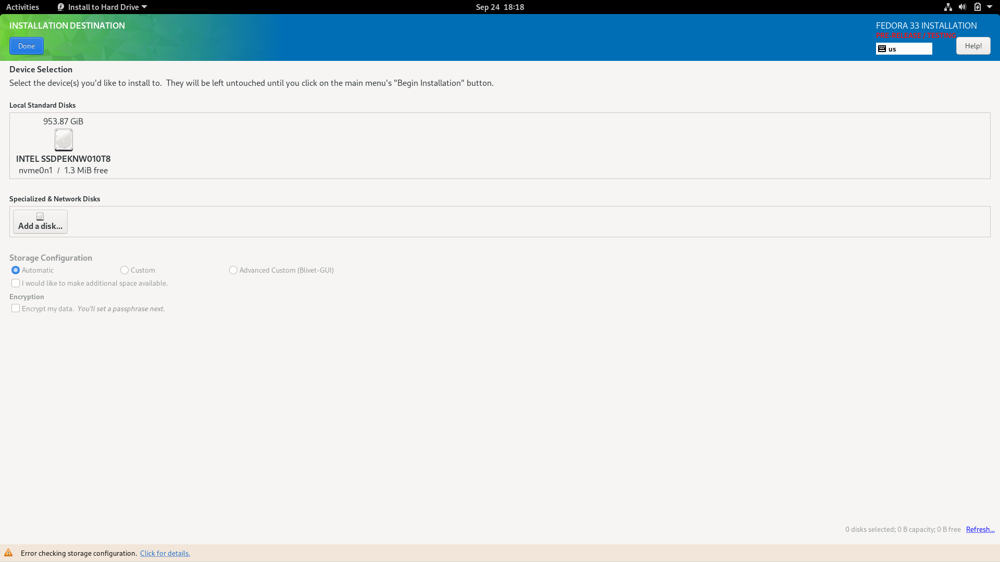

# Fedora Installation Walkthrough

## Prepare USB Installation Disk

To install Fedora, a USB installation disk must be prepared. Navigate to https://fedoraproject.org/wiki/Releases and find the latest release. This guide presumes Fedora v33 or newer will be installed, but at the moment, v33 has not yet been officially released (it is scheduled for release in October 2020). However, a preview release can be downloaded [here](http://mirrors.syringanetworks.net/fedora/linux/development/33/Workstation/x86_64/iso/).

See [Preparing Boot Media](https://docs.fedoraproject.org/en-US/fedora/rawhide/install-guide/install/Preparing_for_Installation/#sect-preparing-boot-media) from Fedora's documentation for instructions preparing an installation disk.

## Installation

### Disable Secure Boot

Before the Fedora installation media can be used, Secure Boot must be disabled in the BIOS. While in the BIOS configuration, Fast Boot must also be disabled. Turn the G14 on, and when the Republic of Gamers splash screen appears, press F2 to enter the BIOS setup utility. Press F7 to enter the advanced mode, and navigate right twice to the section titled "Boot." Select "Fast Boot" and disable it, then press the right arrow key to navigate from the "Boot" menu to "Security." Select "Secure Boot," then disable the option labeled "Secure Boot Control." Afterwards, press right again to reach the "Save & Exit" section. Press enter to save changes and exit, conforming the changes when prompted.

### Boot from Installation Media

With the installation media connected to the G14, turn the G14 on and hit ESC a few times when the "Republic of Gamers" logo appears. This will bring up the boot menu, allowing the choice of either booting from the internal SSD (which comes with Windows 10 pre-installed) or from the USB installation media. If the installation media cannot be selected, then there is either a problem with the media itself, or with the burning process.

A boot menu will appear, showing the following menu options in the top left of the screen:

    Start Fedora-Workstation-Live 33
    Test this media & start Fedora-Workstation-Live 33
    Troubleshooting -->

Select `Test this media & start Fedora-Workstation-Live 33`, which will already be selected, by pressing ENTER. After a few minutes, a graphical interface will appear:


### Install Fedora

Click on "Install to Hard Drive." Next, select the language and region. If using a non-release version of Fedora, agree to the prompt indicating that the version of Fedora about to be installed is unstable, pre-release software.

Next, an installation summary screen will be shown. Under SYSTEM, click on Installation Destination, which indicates that no disks are currently selected. The next screen will allow the G14's internal SSD to be selected:



Select the internal SSD (`INTEL SSDPEKNW010T8` in the above screenshot), check "Encrypt my data" under "Encryption" (if disk encryption is desired), and then click Done in the top left corner. If encryption was selected, supply a passphrase when prompted. Next, a prompt will appear to address the lack of available disk space:


Click "Reclaim Space." A modal dialog will appear to select existing disk partitions, which will contain Windows 10 on a newly purchased G14:


Select "Delete all," and then "Reclaim Space" to complete the dialog.

Next, the installer program will return to the installation summary screen. Click "Begin Installation" to proceed. After a few minutes, installation will finish. Clicking on "Finish" in the bottom right will dismiss the installation program altogether, and leave the desktop empty.

Restart the system by pressing the Windows key, which opens up a search dialog, and typing "restart:"


Press ENTER, and then agree to restart the system when prompted.

### First Boot Into Fedora

After restarting, a boot prompt will appear, similar to that of the USB installation media, allowing the following choices:

    Fedora (5.8.6-301.fc33.x86_64) 33 (Workstation Edition Prerelease)
    Fedora (0-rescue-00c92ef36ecb4b36ba49af6df837ac0a) 33 (Workstation Edition Prerelease)
    System setup

Select the first choice by pressing ENTER.

After booting into Fedora, a setup wizard will appear for initial configuration. The first screen will welcome the user. Click "Start Setup" to proceed. Follow the setup wizard, clicking "Start Using Fedora" when complete. The option to start a tour of Fedora will appear next. After the tour, or if it is skipped, the operating system will be usable. Click on the clock on the top center of the screen to show notifications:


If there is a notification titled "Oops!", click on it to open up the Problem Reporting interface. There is likely a problem related to the system's open source NVIDIA drivers, called `nouveau`:


To fix this problem, `nouveau` must be disabled. This does not mean that the NVIDIA GPU cannot be used; a proprietary driver from NVIDIA will be installed in a later step that will obviate the need for `nouveau` altogether. For now, the entries related to `nouveau` may be dismissed with the "Delete" button in the top right corner of the Problem Reporting interface.

### Open a Terminal

In order to disable `nouveau`, a terminal will need to be opened. To start a terminal, press the Windows key, which opens a search input, and then type "terminal":


Press ENTER to start a terminal. It should look like this:


#### A Note On Sudo

Many commands entered into the terminal will require administrative (or "superuser") privileges, but the terminal that's open has the privileges of the user created during the setup wizard. The `sudo` command allows commands to be input as the superuser. To ensure `sudo` works, try listing the files in a private directory that only the superuser can see with `ls`:

```
[YOUR-USER-NAME@localhost ~]$ sudo ls /root

We trust you have received teh usual lecture from the local System
Administrator. It usually boils down to these three things:

    #1) Respect the privacy of others.
    #2) Think before you type.
    #3) With great power comes great responsibility.

[sudo] password for YOUR-USER-NAME: *type your password*
anaconda-ks.cfg
[YOUR-USER-NAME@localhost ~]$
```

### Disable Nouveau

To prevent `nouveau` from being loaded at boot, edit `/etc/sysconfig/grub` with `nano`, a simple text editor that works in the terminal.

```
[YOUR-USER-NAME@localhost ~]$ sudo nano /etc/sysconfig/grub
```

The editor will look like this:


Using the arrow keys, navigate to the line beginning with `GRUB_CMDLINE_LINUX`. Then press CTRL-E to navigate to the end of the line. The cursor should now be to the right of text that says `rhgb quiet"`. Press the left arrow key once to move the cursor over the double quotation mark, then type `rd.driver.blacklist=nouveau`. The screen should look like this:


To save the file, press CTRL+O. When prompted with `File Name to Write: /etc/sysconfig/grub`, press ENTER to overwrite `/etc/sysconfig/grub`. Then press CTRL+X to quit `nano`.

Next, edit a new file at `/etc/modprobe.d/nouveau-disable.conf`:

```
[YOUR-USER-NAME@localhost ~]$ sudo nano /etc/modprobe.d/nouveau-disable.conf
```

Enter `blacklist nouveau`, then save (with CTRL+O) and exit (with CTRL+X).

Update the boot loader, `grub`, to effect the previous changes:

```
[YOUR-USER-NAME@localhost ~]$ sudo grub2-mkconfig -o /boot/efi/EFI/fedora/grub.cfg
Generating grub configuration file ...
Adding boot menu entry for EFI firmware configuration
done
[YOUR-USER-NAME@localhost ~]$
```

Next, uninstall the `nouveau` driver using `dnf`, which is Fedora's principal package management utility. Press `y` and ENTER when prompted:

```
[YOUR-USER-NAME@localhost ~]$ sudo dnf remove xorg-x11-drv-nouveau
```


The final step involves removing `nouveau` from the initial boot partition:

```
[YOUR-USER-NAME@localhost ~]$ sudo dracut --force /boot/initramfs-$(uname -r).img $(uname -r)
```

Next, reboot the computer as before. An additional dialog may appear asking to install pending software updates. Do *not* check this option; just restart without applying any software updates.

After rebooting, no notifications indicating problems with `nouveau` should appear.

### Update Installed Packages

Search for the program called "Software" (press the Windows key and type "software") and start it by pressing ENTER. After dismissing an initial modal dialog titled "Welcome to Software", the application should look like this:


First, click "Enable" on the right side of the prompt at the top of the window asking to enable third party software repositories. Next, navigate to the updates section of the application by clicking on "Updates" in the top middle of the window. Then, click "Download" to retrieve the updates and, after the download is complete, click "Restart & Install." Confirm the restart, and after the laptop restarts and begins to boot into Fedora, a black screen titled "Installing Updates..." will appear. Allow this process to finish and restart the laptop again.

### Install NVIDIA Proprietary Drivers

Now that the baseline operating system is up-to-date, installing NVIDIA's proprietary drivers is next. Fedora does not allow propriety software to be installed out-of-the-box, but the [RPM Fusion](https://rpmfusion.org) repository offers the NVIDIA drivers (among other proprietary packages). To add the RPM Fusion repository, run the following two commands, agreeing to the confirmation prompts:

```
[YOUR-USER-NAME@localhost ~]$ sudo dnf install https://download1.rpmfusion.org/free/fedora/rpmfusion-free-release-$(rpm -E %fedora).noarch.rpm
```

```
[YOUR-USER-NAME@localhost ~]$ sudo dnf install https://download1.rpmfusion.org/nonfree/fedora/rpmfusion-nonfree-release-$(rpm -E %fedora).noarch.rpm
```

The output should look like this:


Now, install `akmod-nvidia` and `xorg-x11-drv-nvidia-cuda` packages with `dnf`:

```
[YOUR-USER-NAME@localhost ~]$ sudo dnf install akmod-nvidia xorg-x11-drv-nvidia-cuda
```

Restart the operating system and ensure the system loads properly.

### Asus Kernel Drivers

Much of the functionality of the laptop, such as the keyboard backlighting, does not yet work, since Asus-specific kernel drivers need to be installed. There are two `.rpm` package files that must be installed from [here](https://download.opensuse.org/repositories/home:/luke_nukem:/asus/Fedora_Rawhide/noarch/)

Download and install both `dkms-asus-rog-nb-wmi` and `dkms-hid-asus-rog`.

### Install Asus Notebook Control (asus-nb-ctrl)

The next package to install is Asus Notebook Control (abbreviated as `asus-nb-ctrl`).

TODO: Update URL to more permanent location, ideally an asus-linux.org RPM repository

Open Firefox and download the RPM file [here](https://github.com/ntl/zephyrus-g14-linux/raw/master/fedora/asus-nb-ctrl-2.0.4-0.x86_64.rpm). Allow Firefox to open `asus-nb-ctrl-2.0.4-0.x86_64.rpm` with `/usr/bin/xdg-open`. A dialog will open allowing the software to be installed:


Click "Install" (which will prompt for the password). Next, the `asusd` service must be activated. Open a terminal and start `asusd` with `systemctl`:

```
[YOUR-USER-NAME@localhost ~]$ sudo systemctl start asusd
```

Next, use the Fn+F7 and Fn+F8 keys to test adjusting the display brightness levels. If this works, then `asus-nb-ctrl` is able to control the Asus kernel drivers.

Reboot one final time and ensure that the Fn key combinations work as expected.

## Tips

* If the NVIDIA GPU is only needed for computing, and not e.g. games, battery life can be significantly increased by configuring the graphics mode to "compute". This can be done with `asusctl graphics -m compute` in a terminal.

## To Do

* Disable Wayland in `/etc/gdm/custom.conf`:

    WaylandEnable=false

* `dracut.conf.d/90-nvidia-dracut-G05.conf`:

    # filename /etc/dracut.conf.d/90-nvidia-dracut-G05.conf
    # Omit the nvidia driver from the ramdisk, to avoid needing to regenerate
    # the ramdisk on updates, and to ensure the power-management udev rules run
    # on module load
    omit_drivers+=" nvidia nvidia-drm nvidia-modeset nvidia-uvm "

* Test `dracut -f` instead of than the lengthy alternative

* Install all Asus specific RPMs through a single repository
